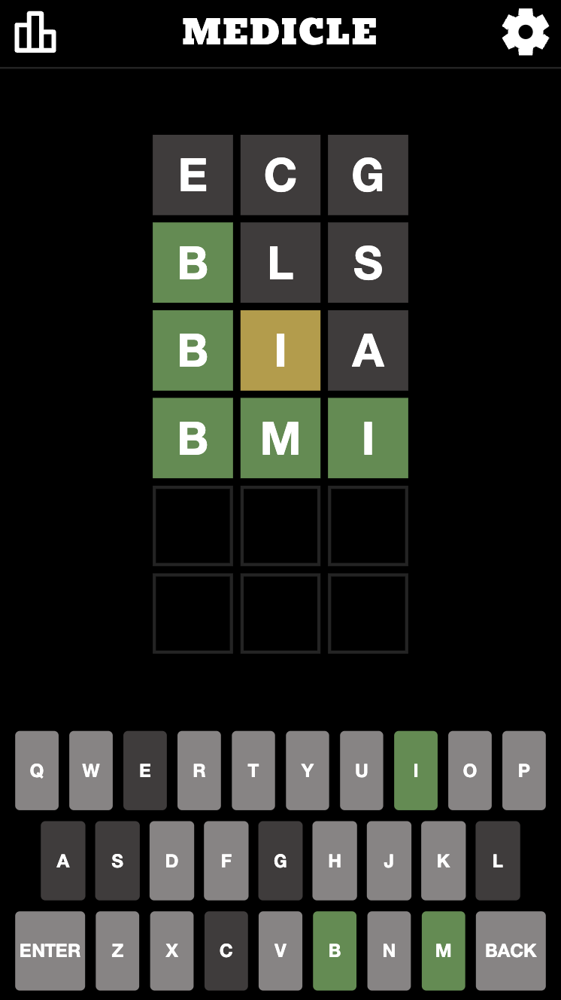

# Medicle
> A Wordle-like game which uses medical acronyms with the purpose of teaching users medically relevant acronyms and their definitions.
> You can find the it at [Medicle.net](https://www.medicle.net)

## Table of Contents
* [General Info](#general-information)
* [Technologies Used](#technologies-used)
* [Features](#features)
* [Screenshots](#screenshots)
* [Usage](#usage)
* [Room for Improvement](#room-for-improvement)
* [Acknowledgements](#acknowledgements)
* [Contact](#contact)

## General Information
- Medicle is a static, client-side only web application built on vanilla Javascript, HTML and CSS.
- Medicle was built to function almost identically to the popular game Wordle.
- Wordle is a web-based word game. Players have six attempts to guess a five-letter word, with feedback given for each guess in the form of colored tiles indicating when letters match or occupy the correct position. Wordle has a single daily solution, with all players attempting to guess the same word.
- Medicle relies on the same concept but rather than using any five-letter word the potential answers are medical acronyms (specifically medical acronyms recognised by the HSE in Ireland).
- The purpose of Medicle is to allow medical professionals or students to practice their knowledge of the acronyms they need to know in a fun and challenging game.

## Technologies Used
- Javascript
- HTML
- CSS
- Webpack

## Features
Alongside the well known features of Wordle, Medicle provides the following additional features:
- A dynamic user interface and game logic which adapts the number of guess squares depending on the acronym of the day.
- An 'Unlimited Mode' which allows users to infinitely play rather than being restricted to the single daily acronym.
- Dark and Light Mode alongside a High Contrast Mode for those with visual impairments.
- A feature which displays the definition of the guessed acronym after each guess.
- Statistic tracking stored in the brower's local storage allowing tracking of their scores without necessitating a cumbersome login which could negatively influence user adoption.

## Screenshots

## Usage
The application is available at [Medicle.net](https://www.medicle.net).

## Room for Improvement
To do:
- Transform the application into an offline-first Progressive Web App as set out [here](https://web.dev/progressive-web-apps)
- Add more in depth statisitcs tracking

## Acknowledgements
Josh Wardle, creator of Worlde.

## Contact
Created by [Frank Pierce](https://www.frankpierce.me/) - feel free to contact me!
